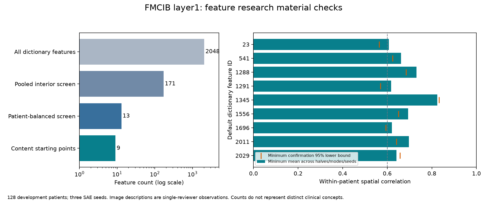

# FMCIB spatial SAE feature checks

The fixed `candidate_fmcib_layer1_d4_k64_s2025` dictionary provides 2,048 spatial features. Thirteen pass the measured numerical screens; nine have repeated broad image-content descriptions suitable as starting points for feature research. They cover bright material, gray or dark regions, and oriented interfaces. Several may describe related patterns. These counts do not establish distinct anatomical concepts or dictionary-wide semantic purity.

## Evidence and assets

- [Reviewed features](reviewed_features.csv): numerical checks, repeat-seed counterpart IDs, image descriptions and use categories for all thirteen candidates.
- [All feature checks](all_feature_checks.csv): all 2,048 features, including those that do not satisfy the project screens.
- [Summary](summary.json): dictionary identity, measured counts, scope and independent numerical verification.
- [Evaluation source](../../scripts/sae_validation/): screening, raw-image controls, image rendering and independent checks.

Development patients were divided into two disjoint groups of 211. A deterministic sample of 64 patients per group supported full activation maps and raw-input checks. Counterparts were selected on discovery patients and evaluated unchanged on confirmation patients for seeds 2026 and 2027. Numerical screening requires patient coverage, translation-following responses, interior raw and position-template-residual correspondence, mean within-patient spatial correlation of at least 0.6, and a confirmation patient-bootstrap 95% lower bound of at least 0.5. Raw and residual correspondence can select different counterpart IDs. Matching is not one-to-one. Intervals are descriptive and unadjusted for feature selection.

The interior is the native 13-cubed grid restricted to indices 2 through 10 on all axes. Position templates use discovery data only. Equal-patient correlations prevent a large response in one patient from dominating pooled correlations. SciPy independently reproduced 832 real patient/feature correlations to a maximum absolute difference of 1.46e-6; saved means and patient counts were also recomputed.

Image review includes the original discovery-selected 32-feature panel and all thirteen numerical candidates, with high, middle and low response patients. Descriptions are single-AI-reviewer observations without independent clinical annotation. The nine `content_starter` entries each showed their stated broad pattern in all four displayed highest-response confirmation patients. This is a description of selected examples, not semantic accuracy. Position modulation, orientation dependence, and responses to source-image padding are retained in each entry. Complete numerical qualification does not itself establish a specific image concept.

The development set previously selected dictionary configurations, and the thirteen-feature selection uses numerical results in both halves. This is conditional development-set qualification. The independent test set remains unused. Clinical identity, segmentation accuracy and feature-specific causal effects have not been evaluated.

The default dictionary retains FVU 0.11884, mean cosine 0.96179 and classifier probability MAE 0.00888 on the full development data. The [training results](../20261008_spatial_sae/README.md) contain the complete reconstruction and classifier checks. Raw CT, patient identities, individual records, activation caches and model weights remain private and subject to provider terms.

## Reproduction

Use the configured pipeline environment and storage paths. The evaluation order is `feature_screen.py`, `feature_images.py`, `feature_interior.py`, then `feature_patient_repeatability.py`. Use `--name` for a distinct run directory. Image extraction checkpoints individual cases. `feature_atlas.py` renders the discovery panel; its confirmation mode requires a saved descriptive review. `feature_interior_atlas.py` computes interior image scores and renders the discovery diagnostic. `feature_qualified_atlas.py` renders the numerical candidates using those saved scores. The private review records and source CT are required to reproduce the local image assessment; the published tables preserve its aggregate outcomes.

`check_feature_validation.py` verifies the smoke image correlations and input translations. `check_patient_repeatability.py` independently verifies the completed patient-balanced calculations. `build_feature_materials.py` rebuilds aggregate tables and the figure from saved results and private review records. It does not retrain models or choose new examples. The exported screen accepts `--protocol` for the protocol-document hash; its default is this public description. Numerical screening and sampling are unchanged from the recorded run.
