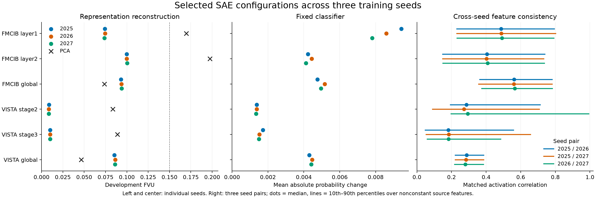

# Selected SAE research materials

Six configuration families provide local spatial, regional spatial and whole-crop
responses for FMCIB and VISTA3D. Each includes seeds 2025, 2026 and 2027; seed 2025
is the default by convention. Selection used 68 completed training runs across
nine representation sites, followed by full-development classifier checks and
three-seed diagnostics. All 18 selected dictionaries pass the recorded criteria.

| Encoder / site | Role | Native grid | Features | Target activity | FVU | Probability MAE | Median matched correlation across seed pairs |
|---|---|---:|---:|---:|---:|---:|---:|
| FMCIB layer1 | Local spatial | 13³ | 2,048 | 128 | 0.07416 | 0.00943 | 0.487–0.492 |
| FMCIB layer2 | Regional spatial | 7³ | 4,096 | 256 | 0.09992 | 0.00422 | 0.402–0.408 |
| FMCIB global | Whole crop | 1 | 4,096 | 256 | 0.09322 | 0.00475 | 0.560–0.565 |
| VISTA3D stage2 | Local spatial | 12³ | 768 | 128 | 0.00885 | 0.00137 | 0.273–0.294 |
| VISTA3D stage3 | Regional spatial | 6³ | 1,536 | 256 | 0.01013 | 0.00172 | 0.181–0.185 |
| VISTA3D global | Whole crop | 1 | 768 | 384 | 0.08546 | 0.00430 | 0.280–0.287 |

FVU and probability MAE above are the default seed's values. FVU is the fraction
of representation variance left unexplained by reconstruction. Lower FVU and
probability MAE indicate greater fidelity. Correlation ranges contain the three
pairwise medians, conditional on nonconstant source features. They are not
confidence intervals. Spatial dictionaries use BatchTopK; global dictionaries
use per-vector TopK. Actual activity is reported separately in the CSV.



## Selection and interpretation

The local configurations preserve the highest-resolution tested native grids.
The regional choices balance spatial resolution, fidelity, activity, dictionary
size and feature correspondence. FMCIB layer2 and VISTA3D stage3 each have better
reconstruction, smaller fixed-classifier changes, higher median cross-seed
correlations and smaller dictionaries than their deeper qualified alternatives.
These are comparisons of each site's own representation, without a claim that
one layer has greater medical meaning.

Global dictionaries encode the final channel mean and return one value per
feature for a crop. Their classifier check replaces that mean while retaining
the original spatial residual. VISTA3D's 768-feature global dictionary improves
reconstruction over its 3,072-feature comparison at the same 384 active
coefficients. Half its features are active per vector; this configuration makes
a substantial activity/fidelity tradeoff.

Matched rank-k PCA has lower reconstruction FVU than both global SAEs: 0.07366
for FMCIB and 0.04644 for VISTA3D. The four selected spatial SAEs have lower FVU
than their corresponding PCA references. PCA and SAE use the same target active
coefficient count; dictionary storage and representation families differ.

Whole-dictionary fidelity is consistent across training seeds. Individual feature
identity is less repeatable. VISTA3D global has no reciprocal feature matches
with correlation at least 0.8 in these diagnostics. Use dictionary-local feature
IDs, inspect actual responses and independently confirm any medical
interpretation. These assets support subsequent experiments; they do not
establish clinically validated concepts or feature-specific causal effects.

## Evaluation scope

- Training: 3,729 records from 1,264 patients. Development: 1,285 records from
  422 patients. The 1,118-record independent test partition remains unused.
- Training samples patients uniformly, then a saved vector within the patient.
  Development metrics weight patients equally and records/positions equally
  within patients. Representation normalization and PCA fitting use training
  patients only.
- Every formal training run executes 12,000 steps. Recorded checkpoint policies
  select either minimum validation FVU or minimum FVU among checkpoints passing
  all unchanged representation criteria. Targeted comparisons retain distinct
  run identities and their observed motivation.
- Representation criteria: FVU ≤ 0.15, mean cosine ≥ 0.95, inactive fraction
  ≤ 0.02, and realized mean activity within 20% of target k. Fixed-classifier
  criteria: probability MAE ≤ 0.025, AUROC decrease ≤ 0.01 and AP decrease ≤ 0.02.
- Cross-seed diagnostics sample up to 16 saved development vectors per patient,
  weight patients equally and match nonconstant features by activation Pearson
  correlation. Coverage and reciprocal matching are reported explicitly. These
  diagnostics use a different sampling scope from earlier full-vector studies.
- All selected exports passed raw-CT inference checks. Saved response summaries
  cover 128 patient-distinct development inputs. Independent CPU checks compare
  native encoding, response statistics and physical-coordinate interpolation,
  accounting explicitly for near-threshold floating-point decisions.

The classifier metrics here use patient weights. They should not be directly
subtracted from earlier record-weighted model-selection summaries.

## Files and reuse

- [Selected runs](selected.csv): all 18 dictionaries, fidelity and activity.
- [Candidate runs](candidates.csv): 68 completed runs plus six disabled,
  unstarted comparison entries; uncomputed values remain empty.
- [Seed consistency](seed_consistency.csv): three seed pairs per configuration,
  correlation quantiles, eligible-feature counts and reciprocal-match fractions.
- [PCA references](pca_reference.csv): training-fitted rank and development FVU.
- [Candidate figure](candidate_quality.png), [selected SVG](selected_quality.svg)
  and [candidate SVG](candidate_quality.svg): direct aggregate visualizations.
- [Provenance](provenance.json): saved source hashes, plotting versions and scope.

Regenerate into a fresh directory with the configured pipeline environment:

```powershell
python scripts/pipeline/export_sae_campaign_results.py --selection --output <fresh-output-directory>
```

Private weights are listed in `20261009_sae_asset_selection/selection.json` under
the configured runs directory, with per-run dictionaries in
`runs/<run_id>/dictionary.pt`. The local viewer's `/dictionaries` route provides
all selected seeds, spatial maps, whole-crop responses and saved quality checks.
See the [viewer guide](../../local_tools/viewers/viewer.md) and
`SpatialSAEPipeline` for raw-image inference. Weights, CT inputs and per-patient
records are kept in private project storage.
